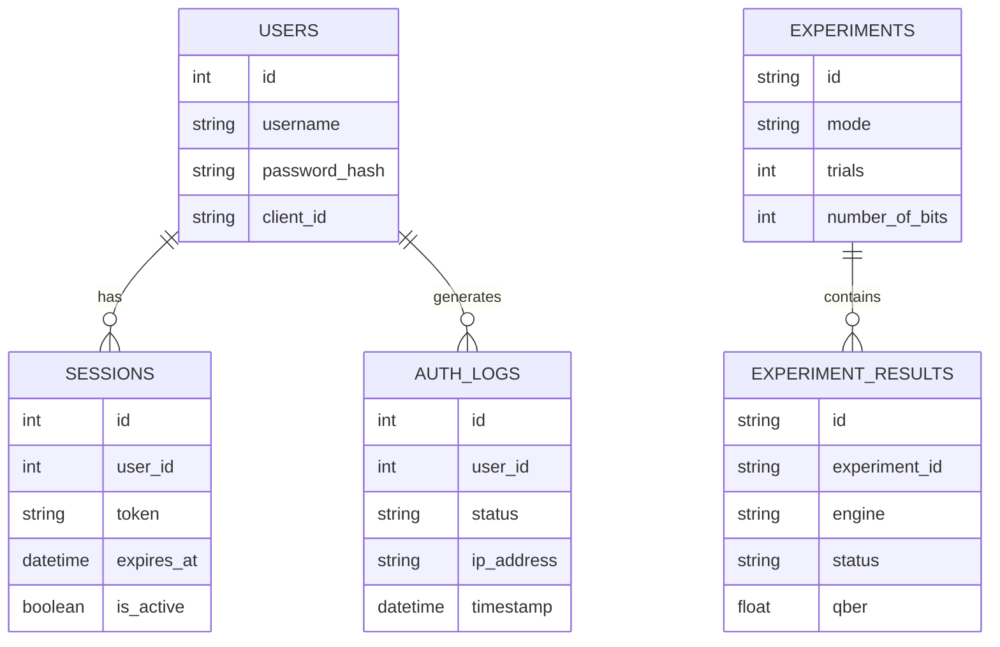

# Database Architecture

## Technology
Qinert utilizes **PostgreSQL**, currently hosted on **Neon**, for robust, scalable relational data storage.

## ORM and Migrations
- **SQLAlchemy 2.0**: Used for object-relational mapping, ensuring type safety and pythonic database interactions.
- **Alembic**: Manages incremental database schema changes (migrations).

## Data Models

## Constraints and Security
- Passwords are never stored in plaintext; they are hashed using bcrypt.
- Sessions are uniquely tracked via secure tokens and include explicit expiration timestamps.
- Raw shared quantum keys are **never** persisted in the database, ensuring forward secrecy.
