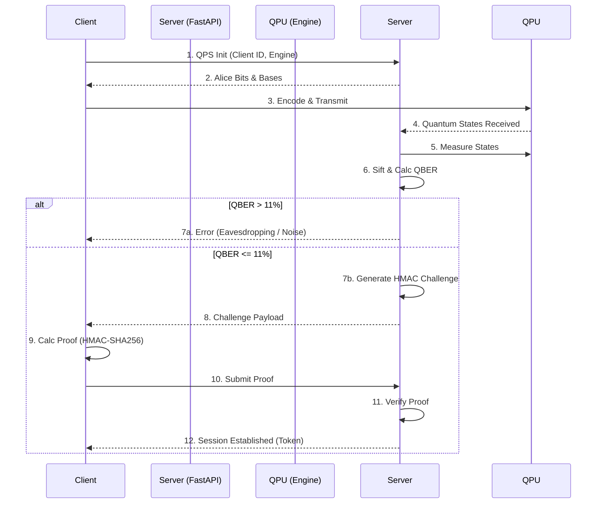

# QPS/1.0 Protocol

## Overview
The **Quantum Protocol for Security (QPS)** Version 1.0 is the proprietary application-layer protocol defining how Qinert clients and servers negotiate a quantum-secured authentication session.

## Core Tenets
1. **Never transmit the shared key**: The quantum-derived key is used strictly for local Proof-of-Possession calculations.
2. **QBER Validation**: Keys are immediately discarded if the Quantum Bit Error Rate (QBER) exceeds the strict security threshold (default 11%).
3. **Stateless Handshakes**: The challenge/response flow avoids prolonged state caching, utilizing strict expiry windows.

## Protocol Flow

## Security Thresholds
- Maximum acceptable QBER: `0.11` (11%)
- Challenge Expiry: `60 seconds`
- Proof algorithm: `HMAC-SHA-256`
