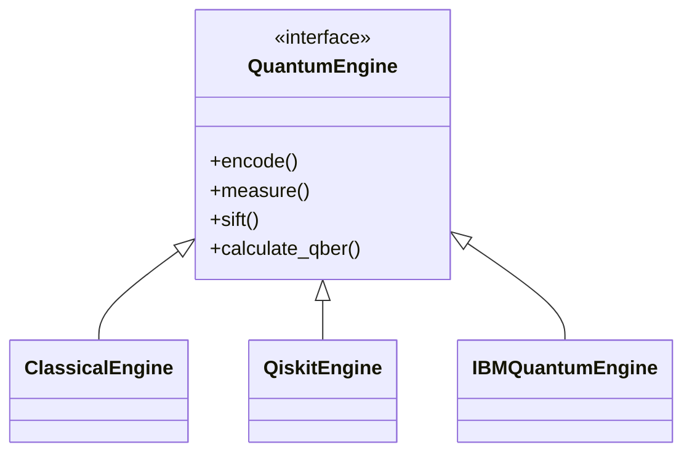

# Quantum Engines

Qinert abstracts quantum execution through a unified `QuantumEngine` interface, allowing the same BB84 protocol logic to run on wildly different backends without altering the core authentication flow.

## The `QuantumEngine` Interface
Defined in `app/quantum/engine.py`, the interface requires implementation of:
- `generate_random_bits`
- `generate_random_bases`
- `encode(bits, bases)`
- `measure(states, bases)`
- `sift(alice_bases, bob_bases, measured_bits)`
- `calculate_qber(alice_bits, bob_bits)`
- `generate_shared_key(sifted_bits)`

## Implementations

### 1. Classical Engine (`ClassicalEngine`)
- **Backend**: Local Python pseudo-random number generator.
- **Purpose**: Fast, deterministic local testing and baseline validation.
- **Characteristics**: Instant execution, exactly 0.0% QBER (in the absence of intentional interception).

### 2. Qiskit Aer Engine (`QiskitEngine`)
- **Backend**: IBM's `qiskit_aer.AerSimulator`.
- **Purpose**: High-fidelity local simulation of quantum circuits.
- **Characteristics**: Supports injection of custom noise models (measurement errors, gate errors) to simulate realistic decoherence. Execution takes milliseconds.

### 3. IBM Quantum Hardware (`IBMQuantumEngine`)
- **Backend**: Real IBM QPUs (e.g., `ibm_brisbane`) via `qiskit-ibm-runtime` and `SamplerV2`.
- **Purpose**: Experimental validation of BB84 circuits on actual quantum hardware.
- **Characteristics**: Asynchronous execution due to IBM cloud queues. Intrinsic hardware noise results in >0.0% QBER. Circuits are dynamically compiled to ISA via `generate_preset_pass_manager`.

